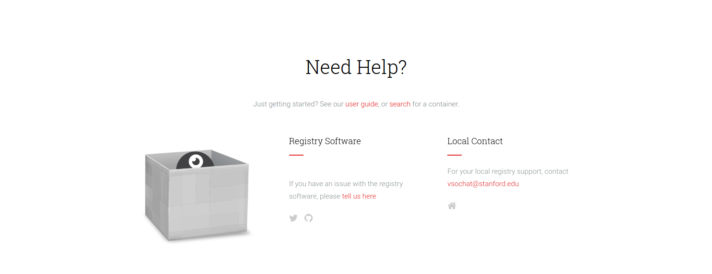
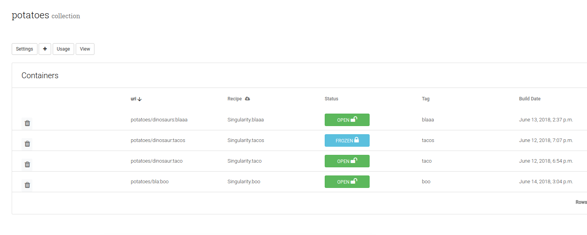
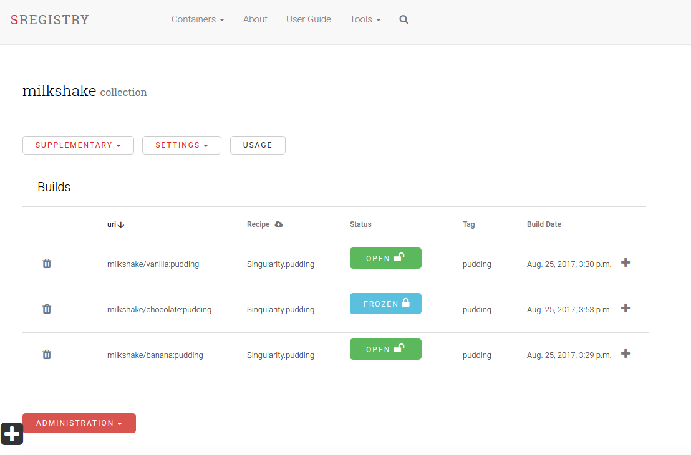
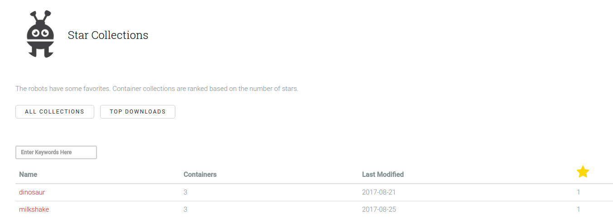

# Introduction
Singularity Registry is a Dockerized web application that an institution or individual can deploy to organize and manage Singularity images. After you [deploy](deployment.md) and [setup](setup.md) your registry, you are welcomed with the home screen. In this case, our institution is called "Tacosaurus Computing Center":
<br>


<br>
You can log in via the social backends that you've configured, in this case, the default is Twitter because it has the easiest setup:
<br>


<br>
And your registry "About" page is specific to your group, meaning a customized contact email and help link:
<br>



<br>
And you can quickly glimpse at the names, links, and relative sizes for all containers in the registry:
<br>


Enough screen shots! Let's get familiar first with some of the basics.


## How are images named?
When you deploy your registry, it lives at a web address. On your personal computer, this would be localhost (127.0.0.1), and on an institution server, it could be given its own domain or subdomain (eg, `containers.stanford.edu`). This means that, for example, if you had a container called `science/rocks` with tag `latest`, and if you wanted to pull it using the [Singularity software](singularity-client.md), the command would be:

```
singularity pull shub://127.0.0.1/science/rocks:latest
```

If you use the [sregistry software](client.md) (the main controller that is configured for a specific registry) then you don't need to use the domain, or the `shub://` uri.

```
sregistry pull science/rocks:latest
```


The name space of the uri (e.g., `/science/rocks:latest`) is completely up to you to manage. Here are a few suggestions for a larger cluster or institution:

 - `[ cluster ]/[ project ]`
 - `[ group ]/[ project ]`
 - `[ user ]/[ project ]`

For a personal user, you could use software categories or topics:

 - `[ category ]/[ software ]`
 - `[ neuroimaging ]/[ realign ]`

Singularity Hub, based on its connection with Github, uses `[ username ]/[ reponame ]`. If you manage repositories equivalently, you might also consider this as an idea. The one constaint on naming is that only the special character `-` is allowed, and all letters are automatically made lowercase. There are fewer bugs that way, trust us.


## How are images shared?
Akin to Singularity Hub, you share your images by making your registry publicly accessible (or some images in it) and then others can easily download your images with the pull command.

```
singularity pull shub://127.0.0.1/science/rocks:latest # localhost
```

You can also generate an expiring link for a user to download the image equivalently:
<br>


## Container Lingo
Let's now talk about some commonly used terms.

### registry
The registry refers to this entire application. When you set up your registry, you will fill out some basic information in settings, and send it to Singularity Hub. When we have a few registries running, we will have a central location that uses endpoints served by each to make images easily findable.


### collections
Each container image (eg, `shub://fishman/snacks`) is actually a set of images called a `collection`. This is the view looking at all collections in a registry:

<br>


<br>
Within a collection you might have different tags or versions for images. For example:

 - `milkshake/banana:pudding`
 - `milkshake/chocolate:pudding`
 - `milkshake/vanilla:pudding`

<br>

<br>

All of these images are derivations of `milkshake`, and so we find them in the same collection. I chose above to change the name of the container and maintain the same tag, you could of course have more granular detail, different versions of the same container:

 - `milkshake/banana:v1.0`
 - `milkshake/banana:v2.0`


## Metadata Lingo

### Labels

A `label` is an important piece of metadata (such as version, creator, or build variables) that is carried with a container to help understand it's generation, and organize it. When you create a Singularity image, you might bootstrap from Docker, and or add a "labels" section to your build definition:

```
%labels
MAINTAINER vanessasaur
```

The registry automatically parses these labels, and makes them searchable for the user.
<br>

<br>
When you investiage an individual label, you can see all containers in the registry that have it! For example, here I reveal that my testing images are in fact the same image named differently, or at least they have two unique sizes:
<br>


### Topic Tags

Topic tags are a way for users to (after build, within the Registry) add "topic words" to describe containers. They are searchable in the same way that labels are:
<br>

<br>
While a label may be something relevant to the build environment, a topic tag is more something like "biology" or the operating system. For example, if you look at the single container view, the Singularity Registry automatically parses the "From" statement to create a topic for each operating system type:
<br>

<br>
Notably, if you are logged in, you can dynamically click and write in a new tag for the container, and it is automatically saved.


## Favorites
Do you have a favorite collection? You can star it! Each Singularity Registry keeps track of the number of downloads (pull) of the containers, along with stars! Here we see the number of stars for our small registry:
<br>

<br>

and equally, container downloads:
<br>

<br>
If there is other metadata you would like to see about usage, please let me know.

## Background

### What infrastructure is needed?
Singularity Registry needs a web accessible server that can install and run Docker and Docker Compose. I (@vsoch) originally started developing it within a Singularity container, but decided to user Docker. Why?

 1. Feedback was strongly that Docker would be ok for such an application. More institutions are able to support separate servers for applications like this.
 2. Docker is great and optimized for orchestration of services. Singularity is not close to that, and with the default image type being an (unchangeable) squashfs, it does not seem to be moving in a direction to be optimized for service containers.
 3. Since images are pushed and pulled via `PUT` and `POST`, it isn't the case that the registry needs to be part of the cluster itself. We don't have the same security concerns as we do with running containers.

As was stated in the base [README.md](./README.md) The components of the application include databases, a web server, worker, and application:

 - **vanessa/sregistry**: is the main uwsgi application, which serves a Django (python-based) application.
 - **nginx**: pronounced (engine-X) is the webserver. The starter application is configured for http, however you should follow the instructions to set up https properly.
 - **worker**: is the same uwsgi image, but with a running command that is specialized to perform tasks. The tasks are run via [celery](http://www.celeryproject.org/), a distributed job queue that fits nicely into Django. The celery worker uses a
 - **redis**: database to organize the jobs themselves.

This means that, given a pretty basic server to run the application, and enough space connected to it to store the images, you can bring the entire thing up relatively quickly. Awesome! Let's get started and talk about first steps of [deployment](deployment.md).
