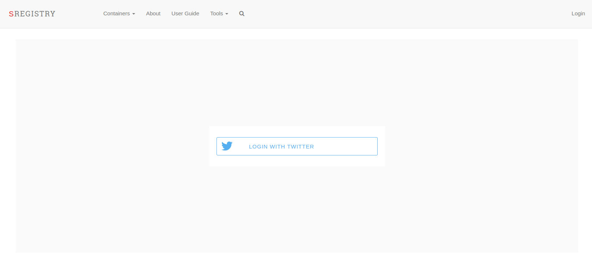
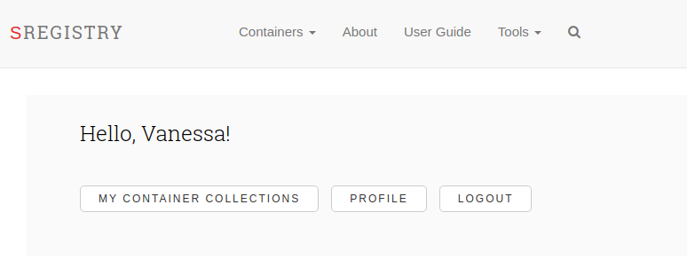
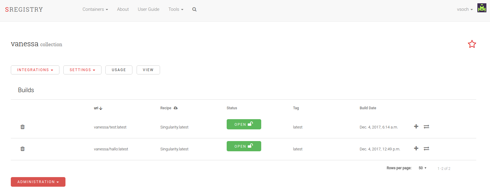

# Globus Connect

The `globus` plugin allows a logged in user to connect their Globus account to allow for transfer of images from the registry to a Globus endpoint. In order to set up this integration, you should be familiar with setting up a Globus personal endpoint, and for this installation example we will walk through doing this on your local machine (or the same filesystem where your Registry will be installed).

## How does Singularity Registry work with Globus?
The quick answer:

>> Singularity Registry works with Globus by serving its filesystem with images as a Globus endpoint.

And the reasons for this design are the following:

 1. The purpose of the registry is to serve images that are accessible via the Singularity command line tool, for anyone using it. Thus, any Globus related content must also have a web-accessible URL (https).
 2. Since https with Globus is under development, the only way for this to be possible is to make the application filesystem a globus directory itself. This means that a single registry can dually share images across a cluster (with globus) and they are also accessible via Singularity proper with https.
 3. When Globus is able to provide an https address for a cluster image (not sure how this would work for clusters that don't want open ports, it would likely be a proxy for it?) then we can think about the possibility of having more distributed image storage.

### Verbose Answer
Globus specializes in transfer and permissions. A Singularity Registry specializes in management of of images, and making those images accessible immediately to the Singularity command line tool. Thus, we have the two (somewhat conflicting) needs:

 1. Every image in a registry must have a web accessible URL (https) to be programmatically available to any user of Singularity (given the appropriate permissions for the image). An image provided in a Registry that is connected to Globus but not accessible by a URL is not acceptable.
 2. Globus does not currently support exposing an https address for a file, and even if it did, many Globus endpoints are installed on clusters that do not want or simply cannot allow exposure of these ports. A single cluster that provides a registry with containers closed off to anyone that doesn't have Globus is not acceptable.

Until a solution is implemented that guarantees that any cluster, via the Globus transfer API, can guarantee a web accessible container to a file on a (closed off to world https) we will take a simple approach that, while it doesn't scale, meets the two criteria.

This strategy ensures that any image added to the Registry is available via standard Globus APIs but also accessible via an HTTPS address. It works as an integration and not solely a login option because it's likely the case that an administrator will want users to log in via institution credentials (e.g., LDAP) and then connect third party services.  More details are discussed below.


## What does the integration add?

We will explore the additions from the experience of this user. Given that the Globus plugin is enabled and that an endpoint is created and known to the application, the user will first need to login: 



The example shows just Twitter, however there are several backends supported by [python social auth](http://python-social-auth.readthedocs.io/en/latest/backends/). When the user is logged in, a quick portal is shown:



And the globus connect button is added to the new integrations tab in the Profile


the redirect goes to the Globus login (and then Stanford SAML)


The user is then presented with the main plugin transfer page, which currently is very simple. There is a tab for each shared / owned endpoint on the left, and given that we aren't visiting it in the context of a particular container, we get a nice message to go browse and find things that we like.


I can do that, and I find a container that I like. As the message suggested, there is a transfer icon added to the table:



When I click it, I see the previous page in the conext of a container, and I have an option to transfer from Singularity Hub to any of my endpoints. Since I only have one endpoint, I just see one option, and that the endpoint "Karl Endpoint" is yellow.


When I click the big arrow in the middle, the transfer action is done on the server, and the message delivered to me in the user interface as a notification. Also note that the node turns blue to indicate I've done the transfer.


This is the minimal working example. There is still a bug with regards to the path that I've filed an issue for, and hopefully it will be a trivial answer to fix and finish up the application. The updates will be more thoroughly summarized below, along with suggestions for extending.


### Updates to the UI
Given that an institution activates the Globus plugin, the user interface has:

1. A "transfer" button added to each container. Each image added to the Registry, still with a "push" would thus be shareable.
2. The logged in user can connect a Globus account

# Development

This is a very simple setup that brings the following up for discussion.

## Bug Fixes
First we need to fix the issue with being able to provide relative paths. I should be able to define an endpoint on the host, map it to the application container, and have it work by calling the path (better, relative path) from within the container.

We also need to define a robust query for finding and serving **all** of a user's endpoints (including servers). This [discussion](https://github.com/globus/globus-sdk-python/issues/253#issuecomment-348849251) is a good point to start.

## Features
1. An ability for a user to subscribe or get a container via Globus, how might it work?

   a. A user would log in with his or her Globus credentials
   b. If a Globus login is detected, the "share" or "subscribe" button is shown next to the transfer
   c. When the user selects to subscribe the Globus API is used to sync that particular file between the two endpoints. This needs to be handled by the Globus API because the registry doesn't have the bandwidth to perform both / constantly monitor.

2. An ability for a registry to subscribe / share all containers with another, and have it done automatically. How does this work?
  - This comes down to permissions for two Globus endpoints
  - Some kind of handshake / agreement has to occur
  - Right now I'm assuming one endpoint being shared with another endpoint coincides with all images/ equivalent permissions   
  - It comes down to a sync, and the sync needs to be hooked up to some kind of ifnotify so that both local and remote registries are updated

3. When a Globus Endpoint is able to serve https, then we can think about having images hosted in the registry separate from the application itself.  When this time comes, we also need to add in another kind of model that (will eventually) support an https (or other external link) for an image. We could either add the model to the current (and an unused field Image.url) and then a local filesystem would have an image file and a remote would have a url, OR create a different kind of container model under the plugin. I'm thinkin the first.

## Limitations
Ideally, if a Globus image on a filesystem external to where the Registry is served can still be accessible via https, then a single registry is much more scalable in allowing for many disparate file systems (and thus a larger storage). It also helps that downloads / general bandwidth isn't the responsibility of one server.


## Endpoint Setup
We will be following the instructions to set up a [globus connect personal](https://www.globus.org/globus-connect-personal) that will serve the Registry, specifically using the linux [instructions for the command line](https://docs.globus.org/how-to/globus-connect-personal-linux/#globus-connect-personal-cli). For me, that looked something like the following:

```
wget https://s3.amazonaws.com/connect.globusonline.org/linux/stable/globusconnectpersonal-latest.tgz
cd /home/vanessa/Documents/
tar xzf /home/vanessa/Downloads/globusconnectpersonal-latest.tgz 
cd globusconnectpersonal-2.3.3/
```

The documentation doesn't do a good job to mention it, but the next command requires installing the [globus client](https://docs.globus.org/cli/installation/):

```
pip install globus-cli

# check install 
which globus

# login
globus login
```

After the above you should have a browser window open up to log you into the client. Then you can proceed with creating a personal endpoint. It comes down to generating a named endpoint and key, and then running a command to set it up:

```
globus endpoint create --personal my-linux-laptop
./globusconnectpersonal -setup <setup-key>

# search for your newly created endpoint
globus endpoint search --filter-scope my-endpoints
```

I wanted to limit what was under the endpoint since the entire of my home scared me, so I opened this file:

```
vim ~/.globusonline/lta/config-paths
```

and changed the following:

```
~/,0,1
#to
~/Documents/Globus/,0,1
```

Then start your endpoint, and see metadata about it:

```
./globusconnectpersonal -start &
globus ls <endpoint_id>
```

However, we would actually want to limit our endpoint to be a folder that is seen by the application, specifically the same folder that our application uses to store images. For our container, this is mounted at "images" and we want it to be read only:

```
~/Documents/Dropbox/Code/sregistry/sregistry/images,0,0
```

You would want to stop and start the endpoint after this change:

```
./globusconnectpersonal -stop
./globusconnectpersonal -start &
```

Finally, make sure to grab your endpoint's id, because we will need to add it to the application to be aware of next. I don't know of the "best way" to search for an endpoint, but I used my email to find it.

```
globus endpoint search vsochat
ID                                   | Owner                | Display Name          
------------------------------------ | -------------------- | ----------------------
74f0809a-d11a-11e7-962c-22000a8cbd7d | vsochat@stanford.edu | vanessasaurus-endpoint
```


## Globus Configuration

### Endpoint
At this point, we have an image folder local to the application also configured as a Globus Endpoint. Next, we want to edit the configuration of our application to enable logging in with globus authentication, and generate a client.

To enable Globus authentication you must:

  * Uncomment the Dockerfile section to install Globus dependencies *before* building the image
  * Uncomment `globus` in the `PLUGINS_ENABLED` list in `shub/settings/config.py`
  * Add `GLOBUS_ENDPOINT_ID` to your secrets.py to be what you generated above with globus endpoint search.

If you don't yet have a `secrets.py` you can copy the `dummy_secrets.py` in the same folder, which has commented out examples of the above. 

### Client
Once your Singularity Registry Then [follow the steps](http://globus-sdk-python.readthedocs.io/en/stable/tutorial/#step-1-get-a-client) to generate a client. Add your client id to the `settings/secrets.py` as `GLOBUS_CLIENT_ID`.


## Questions
1. It seems that the full path of an endpoint is always shown, and I'd prefer the user to just see it from the root. Is this possible? E.g., the path above starts at `Documents` and I just want the user to be aware of the content of `images`. How do relative paths work, or mapping shares to containers (or does this not?)
2. Why would I want globus over just singularity pull?
3. How does Globus make sense for an application running on a server that isn't a part of the cluster?


[..back](../README.md)
